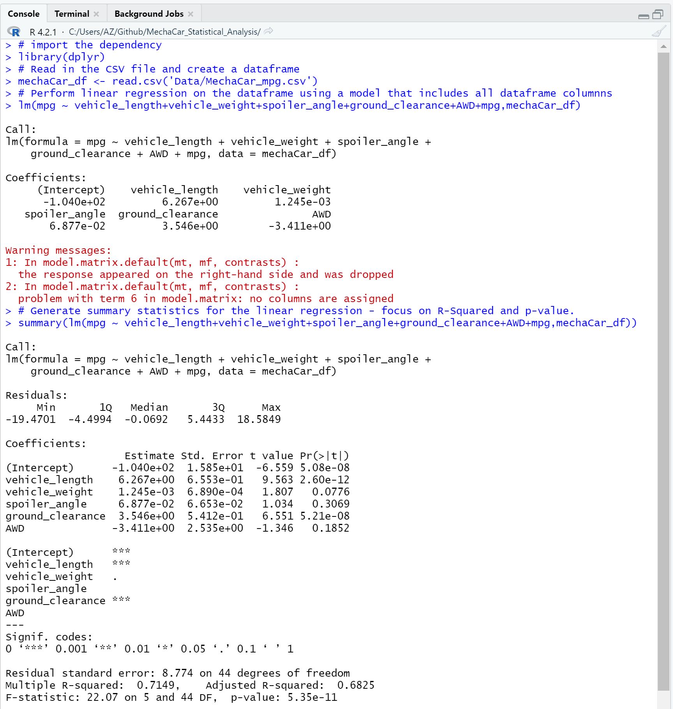

# MechaCar Statistical Analysis with R

## Overview of the Analysis
An automotive manufacturer is developing new model prototypes and is looking to predict the fuel efficiency (MPG) for new prototypes, using data that has been already collected.

## Technology
This project included the following technologies:
* R - Open Source programing language for statistical analysis
* dplyr - an R package that provides a grammar for data manipulation. dplyr is part of tidyverse.
* tidyverse - a collection of R packages designed for Data Science. All of these packages share an underlying design philosophy, grammar, and data structures.  Tidyverse consists of:
    * dplyr
    * ggplot2
    * forcats
    * tibble
    * readr
    * stringr
    * tidyr
    * purrr

## Linear Regression to Predict MPG
An R script was written to import data that was collected from the new model prototypes.

A dataframe was constructed from the imported data, and this was used as the input data for a linear regression analysis.

The output of the script and the linear regression statistics appear in the image below:

    Which variables/coefficients provided a non-random amount of variance to the mpg values in the dataset?
    Is the slope of the linear model considered to be zero? Why or why not?
    Does this linear model predict mpg of MechaCar prototypes effectively? Why or why not?

