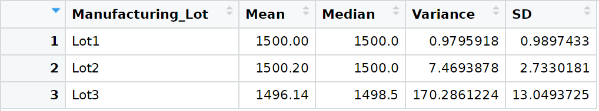
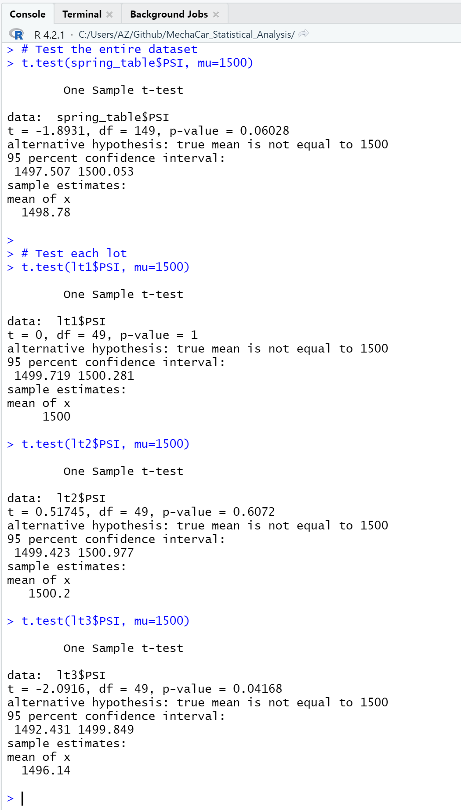

# MechaCar Statistical Analysis with R

## Overview of the Analysis
An automotive manufacturer wants to use statistical analysis within their R&D and production environments to provide information for decision-making.

## Technology
This project included the following technologies:
* R - Open Source programing language for statistical analysis
* dplyr - an R package that provides a grammar for data manipulation. dplyr is part of tidyverse.
* tidyverse - a collection of R packages designed for Data Science. All of these packages share an underlying design philosophy, grammar, and data structures.  Tidyverse consists of:
    * dplyr
    * ggplot2
    * forcats
    * tibble
    * readr
    * stringr
    * tidyr
    * purrr

-----

## Linear Regression to Predict MPG
An automotive manufacturer is developing new model prototypes and is looking to predict the fuel efficiency (MPG) for new prototypes, using production manufacturing data within a statistical analysis.

An R script was written to import data that was collected from the new model prototypes.

A dataframe was constructed from the imported data, and this was used as the input data for a linear regression analysis.

The output of the script and the linear regression statistics appear in the image below:


Assuming a significance level of 0.05%, we see that the p-values for vehicle_length and ground_clearance coefficients are well below the significance level and therefore contribute a statistically significant amount of non-random variance toward the gas efficiency (MPG).

We also see that the intercept value is also a statistically significant contributor in determinig the MPG, so the vehicle_length and ground_clearance features may need scaling or transforming to help the predictive power of this linear model.

Based on the computed p-value for the linear regression analysis (p-value: 5.35e-11), this value is much lower that our assumed confidence level of 0.05%, so we have sufficient evidence to reject our null hypothesis which means that the slope of our linear model is not zero.

This model is relatively effective at predicting the MPG of the prototypes.  According to the computed R-squared value for the linear regression analysis (Multiple R-squared:  0.7149), we can see that this linear model explains 71% of the MPG variability within this dataset. Perhaps by scaling or transforming the vehicle_length and ground_clearance features, the predictive power of this linear model may be enhanced.

-------

## Summary Statistics on Suspension Coils
The manufacturing data for three lots of coil springs (suspension components) is being used as input data to determine whether the manufacturing processes are fulfilling the design specifications.

The existing R script was updated to import the CSV data file and build a table.

A summary of the total collection of data was created to determine whether the entire body of data would conform to the design specification - which is that the variance of the coil springs must not exceed 100 psi (pounds per square inch).

The total summary table shows that the entire data collection suggests that all of these products conform to specification.


A second table was created that grouped the statistical data according to the manufacturing lots.  This data indicates a problem within lot 3.




The measurements within lot 3 indicate a much greater variance than the other two lots, and also exceeds the design specification by 70 psi.

## T-Tests on Suspension Coils
T-tests were constructed to further explore the collection of spring measurements to provide more evidence to prove or disprove the conformance of the product to the design specification.

A T-test was written to test whether the mean of the entire dataset matched the target population mean of 1500 psi.

Three more T-tests were written to test whether the mean from each manufacturing lot matched the target population mean of 1500 psi.
The results are below:




For each t-test, the primary statistic is the computed p-value which indicates whether the computed mean is statistically inside or outside of the confidence interval.

* For the entire data set, the p-value is 0.06028 and indicates that the mean for the entire data set is not statistically different from the target population mean.
* For Lot1, the p-value is 1, which indicates that the mean of the PSI values for this lot perfectly matches the target population mean.
* For Lot2, the p-value is .6072, which is within the confidence interval and indicates that the mean of the PSI values for this manufacturing lot is not statistically different from the target population mean.
* for Lot3, the p-value is 0.04168, which is lower that the 0.05% (95%) confidence interval and indicates that the mean of the PSI values for this manufacturing lot IS statistically different from the target population mean.

-------

## Study Design: MechaCar vs Competition
The car manufacturer (MechaCar) is interested in the creation of a statistical study to measure their performance against the competition.

The following statistical study design is proposed for consideration by MechaCar management.

Metrics to be tested and  ```type of measure```:
* Price ```[continuous]```
* City MPG ```[continuous]```
* Highway MPG ```[continuous]```
* Engine Displacement - cc (Cubic Centimeters) ```[continuous]```
* HP ```[continuous]```
* Seating capacity ```[interval]```
* Cargo volume ```[continuous]```
* Design/styling attractiveness e.g., interior, exterior, colors, wheels, lighting, seats ```[categorical]```

Analytical Questions to be answered by this study:
* Is there a statistical difference between the mean of the sample and population distributions? ```Applies to all continuous and interval metrics ```
* Is there a difference in categorical frequencies between groups?  ``` Applies to categorical metrics ```

Null Hypothesis:
* The null hypothesis that will be proven or disproven by this study is whether there is no statistical difference between the MechaCar model(s) and the competition.

Alternate Hypothesis:
* There is a statistical difference between the MechaCar model(s) and the competition.

Study Significance Level:
* At a minimum, this study will use a high confidence interval (99%). This translates into a 1 in 100 probability of being wrong.

Study Data Requirements:
* The (numerical/continuous) input data is numerical and continuous.
* The sample data is randomly chosen from its population data.
* The input data is considered to be normally distributed.
* The sample size is reasonably large.
* The variance of the input data should be similar.

Study Statistical Analysis:

The actual statistical analysis for this study should be determined after the metrics are chosen.

An example of this proposed analysis is to generate a correlation matrix for the measures to see if there is any relationship amongst them according to the data.

E.g., ```cor(car_comparison$Price,car_comparison$Cargo_Volume,car_comparison$Engine_Disp)```

Based on the results from the correlation matrix, an ANOVA (Analysis of Variance) test can be performed on the metrics to look for further dependencies.  And then, the analyst can perform t-tests on specific measures to determine statistical significance of specific measures, such as Mean, Variance, Min, Max, or Standard Deviation.

For the categorical data, Chi-Squared Tests can be performed to evaluate the frequency data for the different categoriesd to determine preferences.
